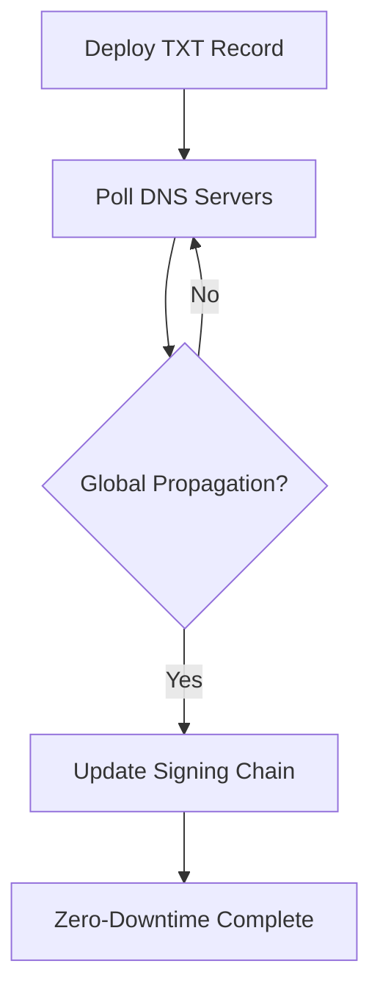

## Project Overview

**Component Status:**
- **DNS Management API:** 100% Complete (PR Submitted) ✅
- **Greenlight Core Services Backend:** 70% Complete 🚧

**Reporting Period:** Project Inception - July 2, 2025

This document outlines the technical progress, architectural decisions, and challenges encountered during the development of a non-custodial payment infrastructure for Shopstr. The project's objective is to integrate Bitcoin Lightning payments via Greenlight nodes, associating them with BIP-353 compliant usernames (`user@domain`) managed through a custom DNS API.

---

## Phase 1: Foundational Research & Environment Scoping
*Pre-May 15, 2025*

The initial phase was dedicated to in-depth technical reconnaissance. The primary areas of focus were the BOLT 12 specification, Greenlight node architecture, and the Cloudflare API.

### Key Technical Deep Dives

**🔍 BOLT 12 Specification Analysis**
- Deconstructed the offer-invoice-payment flow
- Analyzed blinded paths for recipient privacy
- Studied the state machine of an offer

**⚡ Greenlight Node Integration**
- Established secure local development environment
- Configured gRPC client with TLS certificates
- Scripted node lifecycle operations (scheduling, starting, stopping)

**🌐 DNS API Strategy**
- Evaluated Cloudflare API for programmatic DNS management
- Focused on `TXT` record requirements for BIP-353
- Analyzed DNSSEC signing chain complexities

---

## Phase 2: DNS Management API - Implementation & Hardening
*Weeks 1-4*

The project's first deliverable was a standalone backend service for managing DNS records, developed in Go for performance and type safety.

### Core Implementation

**🏗️ RESTful API Framework**
- Built `POST` endpoint for DNS record creation/updates
- Implemented rigorous data validation models
- Sanitized inputs to prevent malformed record creation

### Major Technical Challenge: Idempotent DNSSEC Deployment

**❌ Problem:** Initial attempts at programmatic `DS` record manipulation resulted in transient `serverHold` states, taking the test domain offline due to race conditions between record creation and signing processes.

**✅ Solution:** Re-architected the workflow into a multi-step, idempotent process:



**Key Features:**
- Zero-downtime implementation
- Robust error handling
- Global DNS propagation verification using `dig`
- Self-contained, fully tested service

**📋 Status:** Pull request submitted - ready for integration

---

## Phase 3: Greenlight Core Services - Architecture & Development
*Weeks 5-8*

With the DNS component complete, focus shifted to the main backend service orchestrating user nodes and payments.

### Architectural Design Principles
*Weeks 5-6*

**🔐 Non-Custodial Architecture**
The paramount design principle ensures user BIP-39 seed phrases are:
- Held in-memory exclusively during initial node registration
- **Never persisted** to any storage system
- Replaced by immutable node identifiers from Greenlight

**🔄 Distributed Transaction Design**
The `/register-username` endpoint orchestrates:
1. BOLT 12 offer generation from user's node
2. DNS API invocation to publish the offer

### Implementation Sprint
*Weeks 7-8*

**💳 Payment Handling**
- Implementing gRPC calls for sending/receiving/balance inquiries
- Building robust error handling for payment failures

**🔄 Asynchronous State Management**
**Challenge:** User registration involves long-running operations (node communication, DNS propagation)

**Solution:** WebSocket-based notification system for real-time state updates
- Guaranteed message delivery
- State consistency across client disconnects/reconnects

**🗄️ Caching Strategy Refinement**
**Initial Approach:** Redis with static TTL ❌
- **Problem:** Data staleness when node state changed

**New Architecture:** Responsive cache invalidation ✅
- Redis Pub/Sub for node state changes
- Proactive cache invalidation across all backend instances
- High data consistency across the cluster

---

## Current Status & Architecture Overview

```
┌─────────────────┐    ┌──────────────────┐    ┌─────────────────┐
│   DNS API       │    │  Core Services   │    │  Greenlight     │
│   (Complete)    │◄───│   (70% Done)     │◄───│    Nodes        │
│                 │    │                  │    │                 │
│ • Record Mgmt   │    │ • Payment APIs   │    │ • Lightning     │
│ • DNSSEC        │    │ • WebSocket      │    │ • BOLT 12       │
│ • BIP-353       │    │ • Cache Layer    │    │ • gRPC          │
└─────────────────┘    └──────────────────┘    └─────────────────┘
```

### Progress Summary

| Component | Status | Key Features |
|-----------|--------|--------------|
| **DNS Management API** | ✅ 100% | DNSSEC, BIP-353 compliance, Zero-downtime |
| **Payment Processing** | 🚧 70% | BOLT 12, gRPC integration, Non-custodial |
| **State Management** | 🚧 60% | WebSocket notifications, Redis Pub/Sub |
| **Caching Layer** | 🔄 Refactoring | Proactive invalidation, Cluster consistency |

---

## Next Steps & Roadmap

### Immediate Priorities (Next 2 Weeks)
1. **Complete Payment APIs** - Finish remaining 30% of backend development
2. **WebSocket Layer Hardening** - Ensure reliable real-time notifications  
3. **Integration Testing** - Rigorous testing between DNS and core services
4. **Documentation** - Prepare for mid-term architectural review

### Future Phases
- **Frontend Development** - Next.js UI implementation
- **Security Audit** - Third-party security review
- **Production Deployment** - Kubernetes orchestration
- **Performance Optimization** - Load testing and optimization

---

## Technical Stack

**Backend Services:**
- **Language:** Go (performance, type safety)
- **Database:** Redis (caching, pub/sub)
- **API:** RESTful + WebSocket
- **Infrastructure:** gRPC, TLS certificates

**External Integrations:**
- **Greenlight:** Lightning node management
- **Cloudflare API:** DNS record management
- **BOLT 12:** Bitcoin Lightning offers

**Standards Compliance:**
- **BIP-353:** Bitcoin payment instructions
- **DNSSEC:** DNS security extensions
- **Lightning Network:** BOLT specifications

---

*This project represents a significant step toward making Bitcoin Lightning payments more accessible while maintaining the non-custodial principles that make Bitcoin revolutionary. The architecture ensures users retain full control of their funds while providing a seamless payment experience.*
